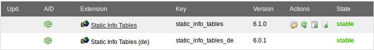

.. ==================================================
.. FOR YOUR INFORMATION
.. --------------------------------------------------
.. -*- coding: utf-8 -*- with BOM.

.. include:: ../Includes.txt

Installation
============

The extension is simply installed using the extension manager.

When installing for the **very first time**, the database updates are performed **automatically**. When **re-installing** after an uninstall or when **updating**, the update script needs to be run **manually** in the extension manager.

**Note:** It is not recommended to change data manually since changes will be lost the next time you run the update script. If you find any data error please report them on http://forge.typo3.org/ for the appropriate extension.

Update script
-------------

The update script can be run manually from the extension manager using the appropriate icon in the Actions column (see screenshot).

The update script of "Static Info Tables (de)" only imports the German translations. When running the update script of "Static Info Tables", the basic data and all language packs are imported. Thus, when the "Static Info Tables" was updated it is sufficient to call its update script only.

	Extension Manager with static_info_tables and static_info_tables_de

	In the actions column, the first icon of "Static Info Tables" will show its configuration options (not available for "Static Infos Tables (de)"). The second icon will run the update script.
